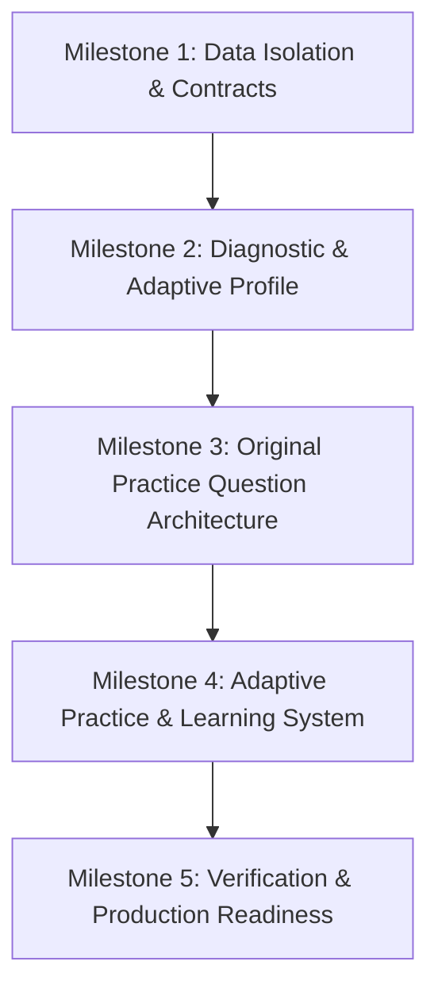

# Adaptive CAT Preparation System — Executive Milestone Report

> **Project:** Intelligent Adaptive CAT Exam Preparation Workspace  
> **Repository:** `CAT Exam`  
> **Status:** Milestones 1–5 Complete & Verified  
> **Date:** September 28, 2026  
> **Production Build:** Next.js 14 (21/21 routes compiled, 0 errors)  
> **Dev Server:** Active at `http://localhost:3000`

---

## Executive Summary

The CAT preparation platform has been transformed from a static question bank into a **genuinely intelligent, adaptive CAT preparation system**. The platform continuously analyzes student diagnostic scores, question velocity, and rolling topic accuracy to adapt the interface, recommended syllabus, question difficulty, and PYQ exposure across three progressive preparation tiers: **Beginner**, **Intermediate**, and **Advanced**.

---

## Milestone Breakdown & Accomplishments



### 1. Milestone 1: Data Isolation & Interface Contracts

* **Authentic CAT PYQ Ingestion & Immutability:**
  * Preserved all **664 authentic CAT previous year questions** across **10 official papers** (CAT 2021 Slot 1/2, CAT 2022 Slot 1/2/3, CAT 2023 Slot 1/2/3, CAT 2024 Slot 1/2).
  * Maintained all reading comprehension passages, DILR multi-question data caselets, official answer keys, and slot metadata without modification.
* **Strict Source Separation:**
  * Enforced discriminated union types:
    ```typescript
    type QuestionSourceType = 'ORIGINAL_PRACTICE' | 'CAT_PYQ';
    ```
  * Synthetic and instructional practice questions can never be presented as official CAT exam questions.
* **Core Type System (`src/lib/types/adaptive.ts`):**
  * Defined data contracts for `AdaptiveProfile`, `Stage`, `DifficultyTier`, `DiagnosticResult`, and `OriginalQuestionSolution`.
  * Implemented sanitization adapters in `src/lib/services/pyqService.ts`.

---

### 2. Milestone 2: 12-Question Diagnostic & Adaptive Placement

* **12-Question Diagnostic Assessment (`/diagnostic`):**
  * Lightweight, distraction-free assessment calibrated to evaluate concept mastery, solving speed, and section baselines:
    * **4 VARC**: Reading Comprehension (Main Idea), Critical Reasoning (Strengthen/Weaken), Para Jumbles (TITA), and Para Summary.
    * **4 DILR**: Linear Arrangements, Matrix & Distribution matching, Venn Diagram 3-Set Deduction (TITA), and Tables/Ratios analysis.
    * **4 QA**: Percentages & Markup, Time & Work Efficiency (TITA), Quadratic Equations, and Triangle Inradius.
* **Deterministic Stage Classification:**
  * $\le 4$ Correct $\rightarrow$ **Beginner** (*Foundational Builder Track*)
  * $5 - 8$ Correct $\rightarrow$ **Intermediate** (*Targeted Application Track*)
  * $\ge 9$ Correct $\rightarrow$ **Advanced** (*CAT Slot Strategist Track*)
* **Adaptive Profile Engine (`src/lib/store/appStore.ts`):**
  * Stores `stage`, `sectionFoundations`, `topicMastery`, `topicAccuracy`, `topicVelocity`, `weakAreas`, and `strongAreas`.
  * Persisted in `localStorage` with zero fabricated stats for new users.

---

### 3. Milestone 3: Original Practice Question Architecture

* **Extensible Question Banks (`src/lib/data/originalQuestions/`):**
  * Multi-topic original practice questions across Quantitative Aptitude, DILR, and VARC with `sourceType: "ORIGINAL_PRACTICE"`.
  * Difficulty Progression: **Foundation $\rightarrow$ Easy $\rightarrow$ Moderate $\rightarrow$ Intermediate**.
* **Comprehensive Pedagogical Solutions:**
  * Every original question includes:
    1. `finalAnswer` & step-by-step mathematical/logical proof
    2. `concept`: Fundamental rule or framework
    3. `whyItWorks`: Theoretical derivation or rationale
    4. `commonMistake`: Traps, misinterpretations, and calculation errors
    5. `catTip`: Speed shortcut or elimination heuristic
    6. `estimatedTime` & `learningObjective`

---

### 4. Milestone 4: Adaptive Practice, Learning & UI System

* **Adaptive Practice Engine (`/practice`):**
  * Questions automatically match the student's stage and rolling mastery when `difficultyFilter = "ADAPTIVE"`.
  * **Intelligent TITA Evaluation:** Flexible comparison supporting sequence formats (`3421`), currency symbols (`₹4,000`), decimals (`2.5`), and fractions (`5/2`).
  * **Mastery Gates:** Sustained $\ge 80\%$ accuracy promotes the student to higher difficulty tiers; repeated low accuracy adjusts difficulty to reinforce foundations.
  * Real-time logging of accuracy, time spent, question feeling, and error classifications to the `MistakeBook`.
* **6-Stage Learning Mode (`/learn`):**
  * Systematic progression: **Learn $\rightarrow$ Solved Example $\rightarrow$ Guided Try $\rightarrow$ Practice Drill $\rightarrow$ Challenge $\rightarrow$ Apply**.
  * Live topic mastery gauges (0–100%) and target difficulty tier badges.
* **Stage-Differentiated Home Workspace (`/`):**
  * Unassessed users receive a prominent prompt to take the Diagnostic.
  * Live header Stage Badge (`Beginner Track`, `Intermediate Track`, or `Advanced Track`).
  * **Beginner Card:** Step-by-step foundation path (Learn $\rightarrow$ Example $\rightarrow$ Guided Try $\rightarrow$ 10 Practice Qs).
  * **Intermediate Card:** Focused drills, speed targets, and error-pattern calibration.
  * **Advanced Card:** Full slot-level simulations, timed sectionals, and exam pacing.
  * **Flow & Persona Switcher:** Developer & aspirant toolbar at the bottom to test any of the three preparation states with a single click.

---

### 5. Milestone 5: Verification & Quality Gate

| Verification Metric | Result | Notes |
|---|---|---|
| **TypeScript Compilation** (`tsc --noEmit`) | **0 Errors** | Strict type compliance across all components and store slices. |
| **Next.js Production Build** (`next build`) | **Success** | All 21 static and dynamic pages generated without warnings. |
| **Authentic PYQ Preservation** | **100% Intact** | Verified 664 official questions and 120-min simulator unaltered. |
| **Local Dev Server** | **Active** | Running smoothly on `http://localhost:3000`. |

---

## Key File Manifest

| File Path | Description |
|---|---|
| `src/lib/types/adaptive.ts` | Type definitions for Stage, SectionType, DifficultyTier, DiagnosticResult, and OriginalQuestion. |
| `src/lib/data/diagnosticQuestions.ts` | 12 curated CAT diagnostic questions with full answer keys and explanations. |
| `src/lib/data/originalQuestions/` | Original question banks across QA, DILR, and VARC with detailed 6-part pedagogical solutions. |
| `src/lib/data/mockDatabase.ts` | Master database isolating authentic PYQs and original practice questions. |
| `src/lib/store/appStore.ts` | Zustand/localStorage state with adaptive profile, stage classification, and mastery gates. |
| `src/app/diagnostic/page.tsx` | 12-question diagnostic test runner, timer, scoring, and stage assignment screen. |
| `src/app/practice/page.tsx` | Adaptive question solver with intelligent TITA evaluation and attempt tracking. |
| `src/app/learn/page.tsx` | 6-stage topic mastery journey with concept summaries, formulas, and progressive challenges. |
| `src/app/page.tsx` | Stage-adaptive home workspace with persona switcher and diagnostic callout. |
