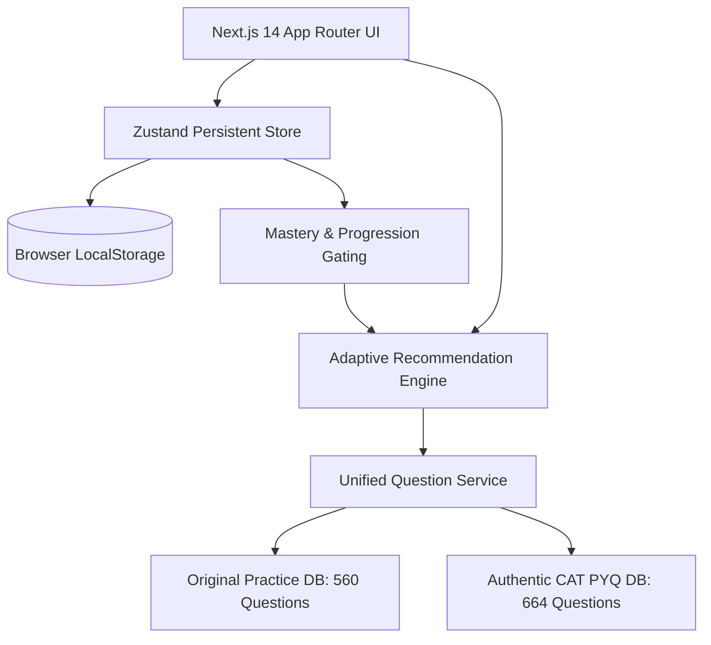

# Architecture & Technical Specifications — CAT 2026 Prep OS

## 1. System Overview & Technology Stack

The platform is engineered as a modern, high-performance Next.js application adhering to enterprise software engineering standards.



### Core Technologies:
- **Framework**: Next.js 14 (React 18, App Router architecture)
- **Language**: TypeScript 5.6 (strict typing across domain models)
- **Styling**: Tailwind CSS with custom Dark/Light theme variables
- **Formula Rendering**: KaTeX math engine with LaTeX typography support
- **Icons**: Lucide React
- **State Store**: Reactive Zustand store with automatic JSON serialization & error recovery

---

## 2. Information Architecture & Routing

| Route | Page Name | Primary Capability | Persona Visibility |
| :--- | :--- | :--- | :--- |
| `/` | Dashboard | Adaptive daily focus, topic cards, persona summary | All (Persona-adaptive) |
| `/diagnostic` | Diagnostic Test | 12-question calibrated test with automatic stage placement | All |
| `/learn` | Concept Learning | 6-stage topic mastery journey with worked examples & formulas | All (Stage-gated) |
| `/practice` | Practice Drills | Real-time adaptive practice with timer, hints, and 6-part solutions | All (Tier-adaptive) |
| `/pyq` | Authentic PYQ | Searchable archive of 664 past questions (2021-2024) | Intermediate & Advanced |
| `/mock` | Mock Simulator | 120-minute timed 3-section simulation with standard CAT marking | Intermediate & Advanced |
| `/progress` | Progress & Analytics | Topic accuracy, rolling mastery metrics, time velocity | All |
| `/mistakes` | Mistake Book | Log of failed attempts with reason tagging & remediation | All |
| `/bookmarks` | Bookmarked Questions | Repository of saved questions with user notes | All |
| `/settings` | Settings & Switcher | Theme preference, diagnostic reset, persona switcher | All |
| `/onboarding` | Onboarding | Stage selection and initial goal setup | All |

---

## 3. Adaptive Engine & Mastery Gating Architecture

### Difficulty Tiers:
Questions are partitioned into 4 difficulty tiers:
1. `FOUNDATION`: Core definitional and computational questions.
2. `EASY`: Direct application of a single standard theorem or formula.
3. `MODERATE`: Multi-step reasoning with potential distractor options.
4. `INTERMEDIATE`: Exam-level complexity combining multiple concepts.

### Rolling Window Mastery Algorithm:
The engine maintains a sliding window of the student's last $N=10$ attempts per topic:
- **Promotion Gate**: If accuracy within the current tier is $\ge 80\%$ over the last 5 attempts, the system automatically advances the student to the next difficulty tier.
- **Demotion / Remediation Floor**: If a student records 3 consecutive incorrect attempts in a tier, the system offers targeted foundational review and temporarily steps down difficulty to rebuild confidence without penalizing the master floor.
- **PYQ Unlock Threshold**: Authentic CAT PYQ sets are unlocked once a student attains $\ge 70\%$ mastery in Moderate practice drills.

---

## 4. Data Models & Schemas

### Original Practice Question Schema:
```typescript
export interface OriginalQuestion {
  id: string;
  section: 'QA' | 'DILR' | 'VARC';
  topicId: string;
  topicName: string;
  subtopic: string;
  conceptTested: string;
  difficulty: 'FOUNDATION' | 'EASY' | 'MODERATE' | 'INTERMEDIATE';
  sourceType: 'ORIGINAL_PRACTICE';
  stage: 'BEGINNER' | 'INTERMEDIATE' | 'ADVANCED';
  questionText: string;
  passage?: string;
  dataset?: string;
  options?: string[];
  correctAnswer: string;
  solution: {
    steps: string[];
    shortcut?: string;
    keyConcept: string;
    alternateApproach?: string;
    commonMistake?: string;
    catTip?: string;
    estimatedTime: number;
    whyItWorks?: string;
    learningObjective?: string;
  };
  hints: string[];
  estimatedTimeSeconds: number;
}
```

### Authentic CAT PYQ Schema:
```typescript
export interface AuthenticCATQuestion {
  id: string;
  paper_id: string;
  year: number;
  slot: number;
  section: 'QA' | 'DILR' | 'VARC';
  question_number: number;
  question_text: string;
  options: string[];
  question_type: 'MCQ' | 'TITA';
  passage_id?: string;
  image_urls: string[];
  correct_answer: string;
  answer_source: string;
  topic: string;
  sourceType: 'CAT_PYQ';
}
```

---

## 5. Storage & Fail-Safe Mechanisms

- **Safe Deserialization**: All reads from `localStorage` pass through a sanitizer that checks for corrupt or missing keys and re-populates valid defaults.
- **Zero Data Contamination**: Authentic PYQ JSON files (`questions.json`, `passages.json`, `catalog.json`) are stored as immutable assets and never overwritten at runtime.
